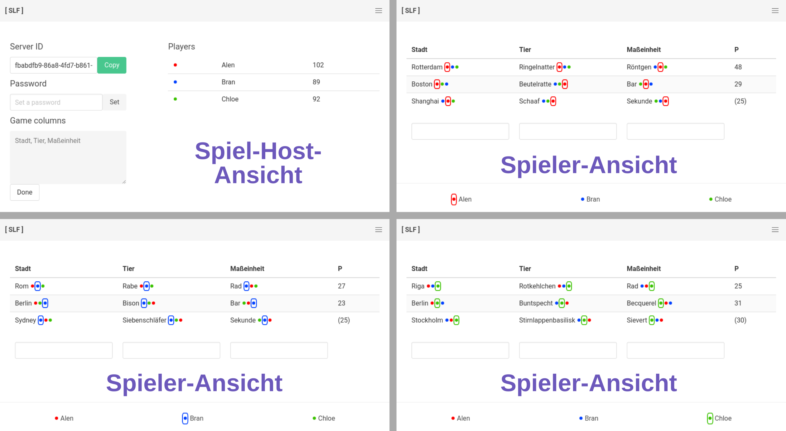
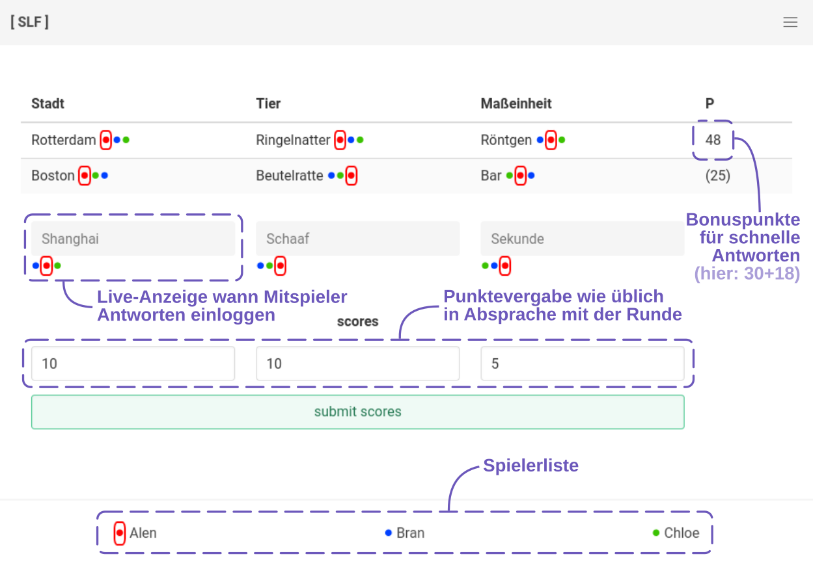

# Stadt, Land, Fluss (web)

Stadt, Land, Fluss für den Browser.



1. In einem Browser Spiel hosten und Kategorien festlegen
2. Mit anderen Browsern dem Spiel beitreten
3. Fertig

## Features



* Live-Anzeige wann Mitspieler Antworten einloggen
* Bonus-Punkte auf Basis von Antwortreihenfolge
* Standard-Punkte (0, 5, 10, 20) wie üblich manuell vergeben

## Technik

* Implementiert mit [PeerJS](https://peerjs.com/)
* UI mit [BULMA](https://bulma.io/)

# WIP Notes

* functional improvements
    * ...

## Ideas

* columns with assigned score check/functions
    * change game.columns from a list of strings to a list of (`<column name>`, `<scoring function>`) tuples
    * in the server UI, let the user set one column after the other (new input once a column is defined)
        * input: column name (text input) and a scoring function (dropdown)

## API based porperty retrieval

### Wikidata

* General
    * [browse](https://www.wikidata.org/)
    * [query w/ SPARQL](https://query.wikidata.org/)

#### Data coverage tests

##### Cities

<details><summary>initial tests</summary>

* [City](https://www.wikidata.org/wiki/Q515): 9,100
    * w/ population: 5,995
* [also City](https://www.wikidata.org/wiki/Q15253706)?
* [City or town](https://www.wikidata.org/wiki/Q7930989): 1,284
    * w/ population: 1,341 (?!)
* [Municipality](https://www.wikidata.org/wiki/Q15284): 561
    * seems to be the transitive parent class of at least Germany cities
* [Human settlement](https://www.wikidata.org/wiki/Q486972): 569,669
    * w/ population: 75,476
    * w/ coordinate location: 436,697
    * w/ inception: 4,045
    * w/ elevation above sea level: 146,370
    * w/ area: 17.093
    * ~~w/ attribute “located in or next to body of water”: 1.236~~ seems very unreliable
    * 

**Query**

```
SELECT (COUNT(?city) AS ?count)
WHERE
{
  ?city wdt:P31 wd:Q486972.
  ?city wdt:P1082 ?population.
}
```

</details>

Query for number of municipalities with population information (208,673).  
(using human settlement, only 89,706)

```
SELECT (COUNT(?mu) AS ?count)
WHERE
{
  ?submu wdt:P279* wd:Q15284.
  ?mu wdt:P31 ?submu.
  ?mu wdt:P1082 ?population.
}
```

Municipalities next to or in a body of water (Germany as example). As below includes rivers which could be filtered.

```
SELECT ?mu ?muLabel ?wtrLabel
WHERE
{
  ?musubclass wdt:P279* wd:Q15284.
  ?mu wdt:P31 ?musubclass.
  ?mu wdt:P17 wd:Q183. # P17: "country", Q183: "Germany"
  ?mu wdt:P206 ?wtr.
  SERVICE wikibase:label { bd:serviceParam wikibase:language "de,en". }
}
```


##### Types of X

```
SELECT ?subcls ?subclsLabel
WHERE
{
  ?subcls wdt:P279* wd:Q15324.
  SERVICE wikibase:label { bd:serviceParam wikibase:language "de". }
}
```

* Gewässer
    * Ozean
    * Wasserfall
    * Flussarm
    * Priel
    * Bucht
    * Loch (e.g. Loch Ness)
    * Sumpf
    * Eisberg
    * Unterwasser-Solebecken
    * Wellenbad
    * Privatbrunnen
* Naturerscheinung
    * Leben
    * Föhn
    * Dämmerung
    * Bodenerosion
    * Doppelregenbogen
    * Sternfleck
    * Superblüte
    * Sonnenwende
    * Gravitationskollaps
    * Haarfarbe
    * Heißer Tag
    * Eiallergie
    * Eifersuchtswahn
* geografische Entität von Menschenhand
    * Kornkreis
    * Mautbrücke
    * Zoo

##### Entertainment

TV series by number of episodes

```
SELECT ?tvseries ?tvseriesLabel ?numeps
WHERE
{
  ?subcls wdt:P279* wd:Q5398426.
  ?tvseries wdt:P31 ?subcls.
  ?tvseries wdt:P1113 ?numeps.
  SERVICE wikibase:label { bd:serviceParam wikibase:language "de". }
}
ORDER BY DESC(?numeps)
LIMIT 100000
```
